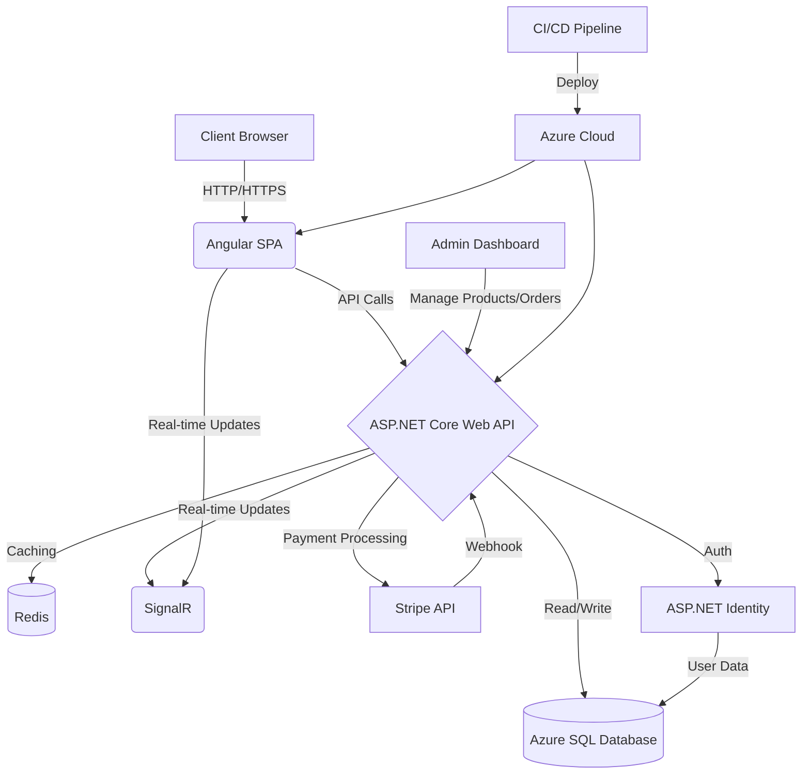

# Outdoor Gear Project

## Overview
This project is a Single Page Application (SPA). Users can browse and purchase various outdoor products, manage their shopping basket in real time, and complete transactions securely. The application aims to provide a seamless shopping experience with a modern UI.
## Tech Stack
- **Frontend**: Angular, TypeScript, Tailwind CSS
- **Backend**: .NET Core, ASP.NET Web API
- **Database**: Azure SQL Database, Entity Framework Core
- **Cloud**: Deployed on Azure, integrated with Redis (Upstash)
- **Payment Processing**: Stripe
- **CI/CD**: GitHub Actions, Azure Pipelines

## Future Improvements
- Improve responsive design for better user experience

## Key features include:
- User authentication using ASP.NET Identity
- Real-time updates for shopping basket using SignalR
- Design optimized using Angular Material and Tailwind CSS
- Integration with Stripe for payment processing
- Dockerized setup for development

##  App Architecture


## Running the Project

To run this project locally, you will need to have the following installed:

1. **Docker**
2. **.NET SDK v8**
3. **Node.js** (Optional for running the Angular app separately)

### Setup Instructions
Clone the project repository to run it locally.

Create a Stripe account and populate the keys from Stripe. In the API folder create a file called ‘appsettings.json’ with the following code:

```json
{
    "Logging": {
      "LogLevel": {
        "Default": "Information",
        "Microsoft.AspNetCore": "Warning"
      }
    },
    "StripeSettings": {
      "PublishableKey": "pk_test_REPLACEME",
      "SecretKey": "sk_test_REPLACEME",
      "WhSecret": "whsec_REPLACEME"
    },
    "AllowedHosts": "*"
  }
```

To use the Stripe webhook locally, install the Stripe CLI and follow the instructions [here](https://docs.stripe.com/stripe-cli) to get a whsec key.

The app uses both SQL Server and Redis as containerized database services running in Docker
```bash
# root directory of the app
docker compose up -d 
```

You can then run both the .Net app and the client app.

```bash
# terminal tab 1
cd API
dotnet run

cd client
# terminal tab 2
ng serve
```

The client app in development is using an SSL certificate generated by mkcert. Instructions provided in its repo [here](https://github.com/FiloSottile/mkcert) :

```bash
# cd into the client ssl folder
cd client/ssl
mkcert localhost
```

